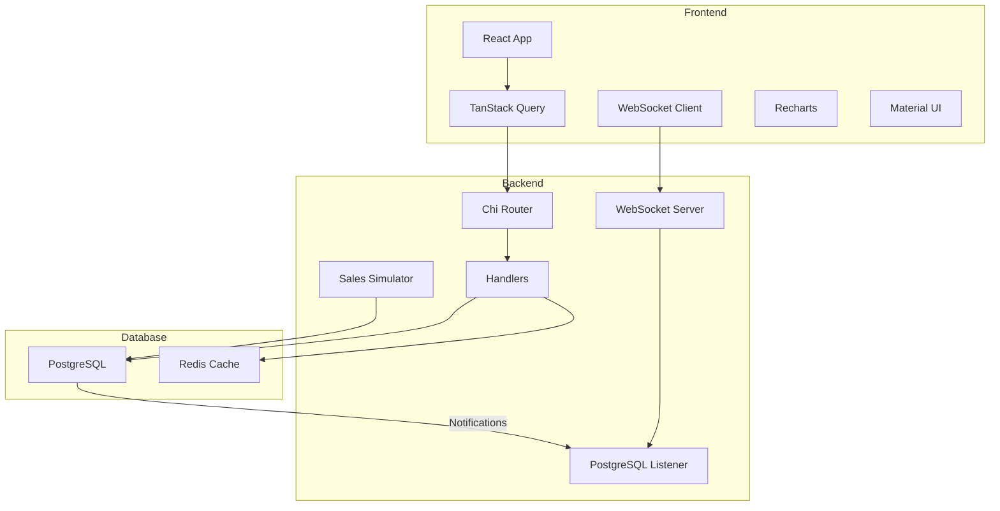

# madden-solution

## Architecture

## Technical Implementation

### Frontend
- **State Management & Data Fetching**
  - TanStack Query for client-side cache management and data synchronization
  - Axios for HTTP requests
  - WebSocket for real-time sales updates
  - React hooks for local state

- **UI Components**
  - Material UI (MUI) for component library
  - Recharts for data visualization
  - Custom components for specific features

### Backend
- **API Layer**
  - Chi router for HTTP routing
  - WebSocket handler for real-time updates
  - PostgreSQL LISTEN/NOTIFY for event handling

- **Data Layer**
  - PostgreSQL for persistent storage
  - Redis for optional caching
  - Sales simulation worker
