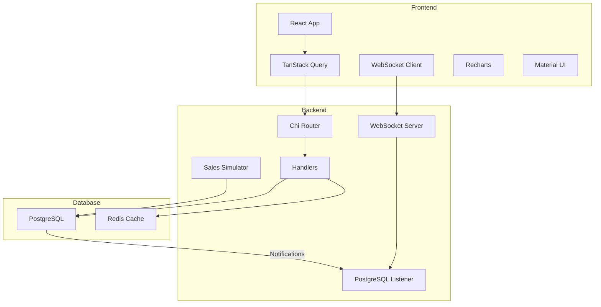

## Prerequisites

- [Node.js](https://nodejs.org/) (v16 or higher)
- [Docker](https://www.docker.com/products/docker-desktop/) (required for database and backend)

## Quick Start

1. Clone the repository and navigate to the project directory:
   ```bash
   cd optimo
   ```

2. Start the backend services (PostgreSQL, Redis, and Go backend):
   ```bash
   docker-compose up
   ```
   This will:
   - Create and initialize the PostgreSQL database
   - Set up the database schema
   - Populate the database with sample data
   - Start Redis
   - Start the backend service

3. In a new terminal, start the frontend:
   ```bash
   cd frontend
   npm install
   npm run dev
   ```

## Accessing the Application

- Frontend: http://localhost:5173
- Backend API: http://localhost:8080

## Architecture


## Technical Implementation

### Frontend
- **State Management & Data Fetching**
  - TanStack Query for client-side cache management and data synchronization
  - Axios for HTTP requests
  - WebSocket for real-time sales updates
  - React hooks for local state

- **UI Components**
  - Material UI (MUI) for component library
  - Recharts for data visualization
  - Custom components for specific features

### Backend
- **API Layer**
  - Chi router for HTTP routing
  - WebSocket handler for real-time updates
  - PostgreSQL LISTEN/NOTIFY for event handling

- **Data Layer**
  - PostgreSQL for persistent storage
  - Redis for optional caching
  - Sales simulation worker

