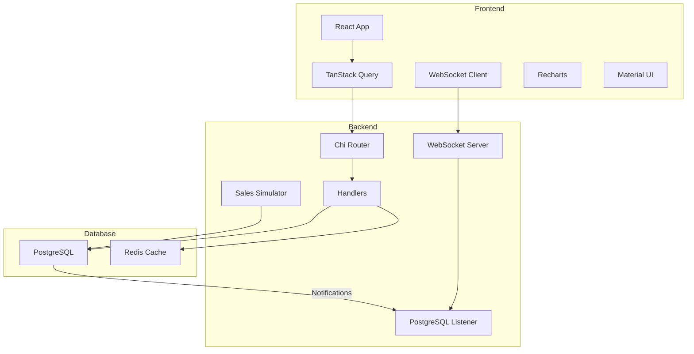

# madden-solution

## Prerequisites

- [Node.js](https://nodejs.org/) (v16 or higher)
- [Docker](https://www.docker.com/products/docker-desktop/) (required for database and backend)

## Quick Start

1. Clone the repository and navigate to the project directory:
   ```bash
   cd optimo
   ```

2. Start the backend services (PostgreSQL, Redis, and Go backend):
   ```bash
   docker-compose up
   ```
   This will:
   - Create and initialize the PostgreSQL database
   - Set up the database schema
   - Populate the database with sample data
   - Start Redis
   - Start the backend service

3. In a new terminal, start the frontend:
   ```bash
   cd frontend
   npm install
   npm run dev
   ```

## Accessing the Application

- Frontend: http://localhost:5173
- Backend API: http://localhost:8080

## Architecture


## Technical Implementation

### Frontend
- **State Management & Data Fetching**
  - TanStack Query for client-side cache management and data synchronization
  - Axios for HTTP requests
  - WebSocket for real-time sales updates
  - React hooks for local state

- **UI Components**
  - Material UI (MUI) for component library
  - Recharts for data visualization
  - Custom components for specific features

### Backend
- **API Layer**
  - Chi router for HTTP routing
  - WebSocket handler for real-time updates
  - PostgreSQL LISTEN/NOTIFY for event handling

- **Data Layer**
  - PostgreSQL for persistent storage
  - Redis for optional caching
  - Sales simulation worker

## Improvements
- Make state persistent for daily, monthly, and yearly data. Navigating to daily stats takes some time because the data needs to be loaded into the graphs. This could be done once and cached, allowing instant loading when switching back to daily from monthly or yearly.
- Set a threshold for how far back daily stats should be displayed to reduce the amount of data that needs to be loaded. Pre-fetch daily and yearly data in the background so it’s always ready when the user clicks the tab. Update current stock immediately when a new purchase is made.
- Improve error handling. Implement structured error handling with custom error types and consistent error responses across all endpoints.
- Better organization overall for backend logic. Handler.go is quite massive and it's handling waaay to many things. 
- Implementing Redis
- Not really using hot-reloading through air. Could probably remove with the current setup
